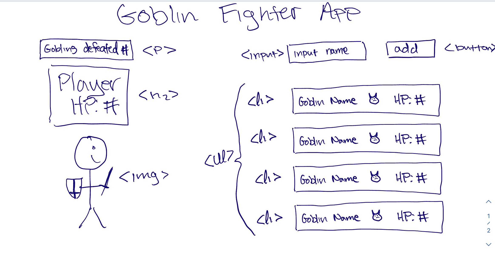

## HTML Setup

### Static HTML

    - Input box and button
    - fighter image
    - defeated goblins el
    - player hp
    - el to append new goblins to

### Dynamic HTML

    - Goblin divs
        - name el
        - emoji el
        - HP el

## State

    - Player HP
    - Goblin HP
    - Goblin Kill Count

## Events

    - click 'challenge goblin' button to add a new goblin and a random value for hp
    - click individual goblin to fight a goblin
        - either a hit or miss on attack and counter attack
